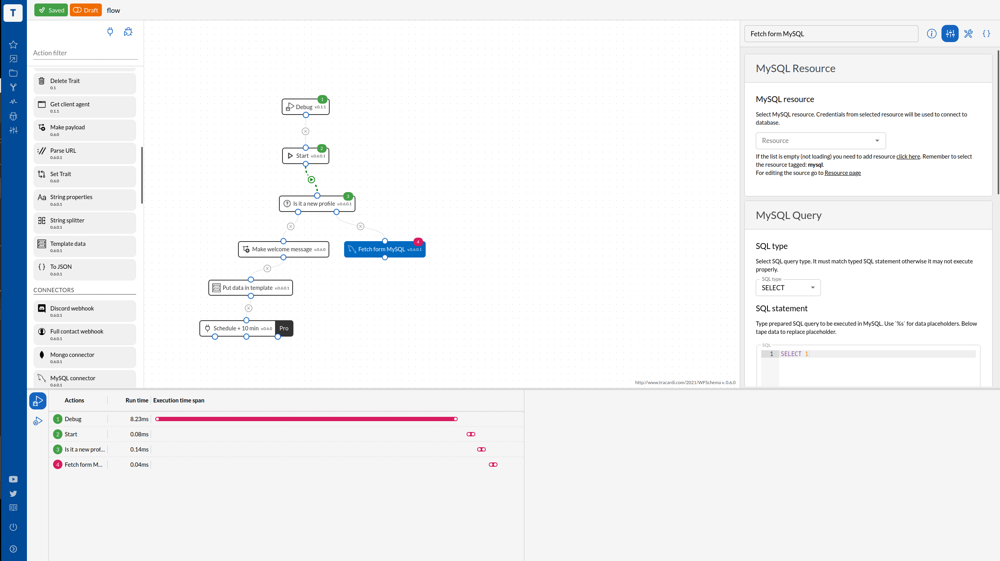

# Tracardi Customer Data Platform

[Tracardi](http://www.tracardi.com)  is an open-source Customer Data Platform.

TRACARDI is a Customer Data Platform that provides a low-code/no-code solution for businesses looking to use customer
data for various purposes. As an API-first platform, TRACARDI can be easily integrated into a wide range of systems,
whether brand new or legacy.

One of the key features of TRACARDI is its ability to **ingest, aggregate, and store customer data from multiple sources
in real-time** This allows businesses to manage customer data at any scale, ensuring that they have access to the most
up-to-date and comprehensive information.

TRACARDI also provides tools for **managing and modeling customer data**, including the ability to define rules that
shape the data as it is delivered and copied into user profiles. This allows businesses to **segment customers into
custom groups and target them more effectively**.

In addition to managing customer data, TRACARDI can also be used to **personalize the user experience** through
real-time customer segmentation and targeting. This allows businesses to deliver more relevant and targeted content and
experiences to their customers, **improving the overall customer experience**.

TRACARDI also provides **tools for unifying customer data** from various sources into a single profile, including the
ability to de-duplicate customer records and blend multiple customer accounts into a single unified profile. This makes
it easier for businesses to manage and understand their customer data.

Finally, TRACARDI is a powerful **framework for creating marketing automation** apps, enabling businesses to easily send
data to other systems and automate various processes. Overall, TRACARDI is a comprehensive platform that provides a wide
range of tools for managing, understanding, and utilizing customer data.

## Screenshots

### Browsing events

### Workflows

### Test console

## Video introduction

[YOUTUBE Tracardi](https://www.youtube.com/channel/UC0atjYqW43MdqNiSJBvN__Q)

