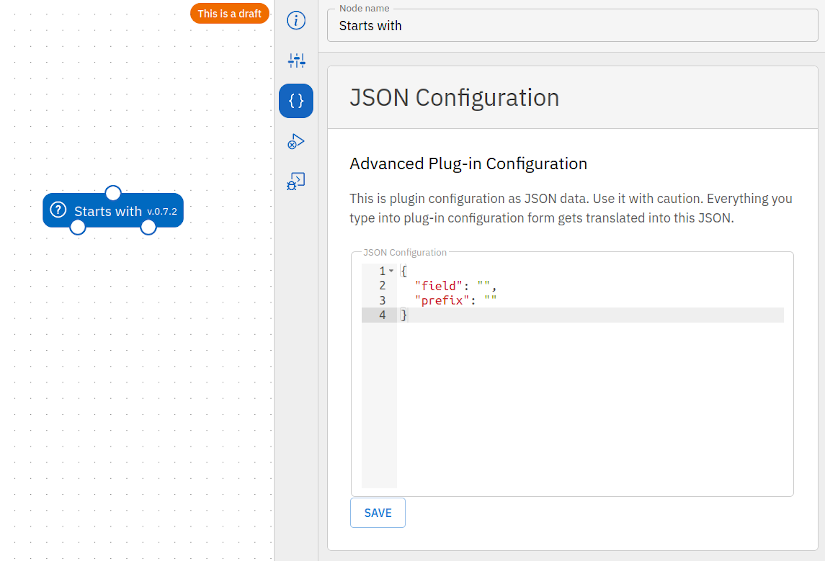
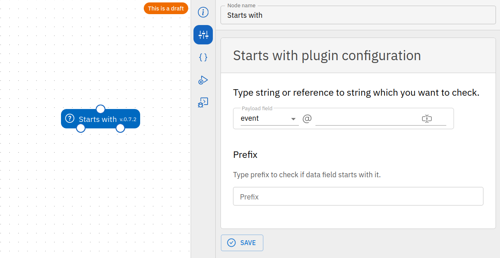

# Part 2: Configuring the plugin in Tracardi

In the next part of our tutorial, we will learn how to configure a plugin and how to add a configuration form to that
plugin.

In the previous tutorial we wrote the plugin that performs a simple action and checks if the event we are processing
is equal to "my-type". Our code looked like this:

!!! Info
    Please click (+) to see the comments for the code

```python
if self.event.type == "my-event":  # (1)
    return Result(port="MyEvent", value=payload)
else:
    return Result(port="NotMyEvent", value={})
```

1. `self.event` gets the event that is being processed from the internal workflow state.

You can see that such plugin is not very useful, because the user cannot configure it to change "my-event" to any
defined event type. Let's try to change that.

From the previous tutorial, we remember that the plugin has the following life cycle:

    __init __ ()
    async set_up (config)
    async run (input_payload)
    async close ()

It is easy to notice that it has a `set_up` method that accepts the `config` parameter, which is the plug-in's
configuration. In the Tracardi system, the configuration is performed while editing the plug-in. We can do this in two
ways.

The first by providing a dictionary with configuration values (Below is a screenshot showing such a configuration in the
JSON Editor and Configuration Form)

=== "JSON configuration editor"
    
=== "Configuration form"
    

The second way is to complete the form. It is related to the JSON configuration in such a way that when filling in the
form fields, we automatically fill/change the JSON object.


The first way is available out-of-the-box. Developer defines the default JSON object when registering the plugin and
this is it. This object will appear in the `set_up` method as a `config` parameter.

So let's expand our plugin with configuration.

## JSON Configuration

In the register function, we add the following entry in the spec:

```python
init = {
    "event_type": ""  # (1)
}
```

1. We set up `event_type` as empty string. Later user inside the system can change it to something meaningful. The init
   serves as a default configuration value.

This way we define that the object should have the "event_type" property, which we will use later in the plugin.

The entire register function should look like this:

```python hl_lines="11-13"
from tracardi.service.plugin.domain.register import Plugin, Spec, MetaData


def register() -> Plugin:
    return Plugin(

        start=False,
        spec=Spec(
            module=__name__,
            className=MyPlugin.__name__,
            init={  # (1)
                "event_type": ""
            },
            inputs=["payload"],
            outputs=["MyEvent", "NotMyEvent"],
            version='0.1',
            license="MIT",
            author="Your Name"
        ),
        metadata=MetaData(
            name="My first plugin",
            desc='Checks if the event type is equal to my-event.',
            group=["Test plugin"]
        )
    )
```

1. Configuration initialisation

OK now let's use `event_type` in the plugin. First, we will have to read the initialized configuration and save it to
the object.

We will use the `set_up` method for this.

```python
from tracardi.service.plugin.runner import ActionRunner


class MyPlugin(ActionRunner):
    config: dict

    async def set_up(self, config):
        self.config = config

    ...  # (1)
```

1. The rest of the code

This way we saved the configuration data in the plugin class.

Now let's use the `self.config` property in the run method and replace __"my-event"__ with it.

```python
from tracardi.service.plugin.runner import ActionRunner
from tracardi.service.plugin.domain.result import Result


class MyPlugin(ActionRunner):
    config: dict

    async def set_up(self, config):
        self.config = config

    async def run(self, payload: dict, in_edge=None):
        if self.event.type == self.config['event-type']:
            return Result(port="MyEvent", value=payload)
        else:
            return Result(port="NotMyEvent", value={})
```

That's it for the moment.

The whole process is as follows. The system registers the plugin and saves in it the default configuration from
the `Spec.init` property. In our case it is:

```json
{
  "event_type": ""
}
```

When the user moves the plug-in to the workflow and starts it, the configuration from the plug-in is put as a parameter
to the `set_up` method. In the method, we set `self.config` to the value from the parameter (i.e. the one
from `spec.init`).
If the user changed the configuration in the editor before the first run, the changed values are of course substituted
as the config parameter.

Then `self.config` is used to read the value of `event-type` and perform a
comparison `if self.event.type == self.config['event-type']` in the run method.

Complete code looks like this:

=== "/tracardi/process_engine/action/v1/my_plugin_folder/my_plugin.py"

    ```python
    from tracardi.service.plugin.runner import ActionRunner
    from tracardi.service.plugin.domain.result import Result
    from tracardi.service.plugin.domain.register import Plugin, Spec, MetaData
    
    class MyPlugin (ActionRunner):
    
        config: dict
        
        async def set_up(self, config):
          self.config = config
        
        async def run(self, payload: dict, in_edge = None):
            if self.event.type == self.config['event-type']:
                return Result(port = "MyEvent", value = payload)
    
            else:
                return Result(port = "NotMyEvent", value = {})
    
    def register () -> Plugin:
        return Plugin (
    
            start = False,
            spec = Spec (
                module = __name__,
                className = 'MyPlugin',
                init = {
                   "event_type": ""
                },
                inputs = ["payload"],
                outputs = ["MyEvent", "NotMyEvent"],
                version = '0.1',
                license = "MIT",
                author = "Your Name"
            ),
            metadata = MetaData (
                name = "My first plugin",
                desc = 'Checks if the event type is equal to my-event.',
                group = ["Test plugin"]
            )
        )
    ```

!!! Info
    Please check if the code works step by step. You do not have to implement everything to check if the code works.
    Every time you complete some part of the tutorial you may save the changes and reinstall plugins and see how it
    works in the workflow editor. Installation of the changed plugin can be done in the workflow editor by clicking
    the `Reinstall plugins` button.

## Validation

Note that although the code works, there may be a situation in which the user in the json editor deletes the initialized
value

```json
{
  "event_type": ""
}
```

and puts any other, for example:

```json
{
  "Type": "",
  "Position": 1
}
```

Then our code will not work, and we will get `KeyError` when trying to read the value in `self.config['event_type']`.
So we need a validation that will not allow the user to enter incorrect values.

For this we will use the `PluginConfig` object.

```python
from pydantic import validator
from tracardi.service.plugin.domain.config import PluginConfig


class Configuration(PluginConfig):
    event_type: str  # (1)

    @validator("event_type")  # (2)
    def must_not_be_empty(cls, value):
        if len(value) == 0:
            raise ValueError("Event type can not be empty.")
        return value
```

1. Tells that the object has a property named `event_type` and it is of type string. `None` value is not allowed.
2. `@validator("event_type")` and the method below checks if the value of event_type is not empty.

The above class defines what our configuration object should look like.

1. `event_type: str` tells that the object has a property named event_type and it is of type string. `None` value is not
   allowed.
2. `@validator("event_type")` and the method below checks if the value of event_type is not empty.

Let's use a validator to validate the configuration. For this we need to create a validate function.

```python
def validate(config: dict):
    return Configuration(**config)
```

And we'll use it when setting up `self.config`.

```python
from tracardi.service.plugin.runner import ActionRunner
from tracardi.service.plugin.domain.result import Result
from pydantic import validator
from tracardi.service.plugin.domain.config import PluginConfig


class Configuration(PluginConfig):  # (1)
    event_type: str

    @validator("event_type")
    def must_not_be_empty(cls, value):
        if len(value) == 0:
            raise ValueError("Event type can not be empty.")
        return value


def validate(config: dict):  # (2)
    return Configuration(**config)


class MyPlugin(ActionRunner):
    config: Configuration  # (3)

    async def set_up(self, config):
        self.config = validate(config)  # (4)

    async def run(self, payload: dict, in_edge=None):
        if self.event.type == self.config.event_type:  # (5)
            return Result(port="MyEvent", value=payload)
        else:
            return Result(port="NotMyEvent", value={})
```

1. Definition of configuration schema. Any data passed to this object will be automatically validated.
2. Validation function. The name of this function must be `validate`. The system GUI use it internally for validation of
   any Form and JSON data.
3. Notice a change in the type of config. Now it is not dict but `Configuration` type
4. Here we use the validation function when we validate the passed data.
5. Here we use the Configuration object to compare values.

!!! Info
    Please click (+) to see the comments for the code

Now it is time to see if the code works.

!!! Info
    Please check if the code works step by step. You do not have to implement everything to check if the code works.
    Every time you complete some part of the tutorial you may save the changes and reinstall plugins and see how it
    works in the workflow editor. Installation of the changed plugin can be done in the workflow editor by clicking
    the `Reinstall plugins` button.

## Plugin form

Setting the configuration with the JSON editor is not very convenient. That's why we should add a form to make the
process of plugin configuration easier.

As you probably guessed, it is done by adding another parameter to the register function.

```python
from tracardi.service.plugin.domain.register import Plugin, Spec, MetaData
from tracardi.service.plugin.domain.register import Form, FormGroup, FormField, FormComponent  # (1)


def register() -> Plugin:
    return Plugin(

        start=False,
        spec=Spec(
            module=__name__,
            className='MyPlugin',
            init={
                "event_type": ""
            },
            form=Form(groups=[  # (2)
                FormGroup(
                    name="Event type plugin configuration",
                    description="Define required event type",
                    fields=[
                        FormField(
                            id="event_type",  # (3)
                            name="Event type",
                            description="Event type to check",
                            component=FormComponent(type="text", props={"label": "Event type"})  # (4)
                        )
                    ]
                ),
            ]),
            inputs=["payload"],
            outputs=["MyEvent", "NotMyEvent"],
            version='0.1',
            license="MIT",
            author="Your Name"
        ),
        metadata=MetaData(
            name="My first plugin",
            desc='Checks if the event type is equal to my-event.',
            group=["Test plugin"]
        )
    )
```

1. Notice that we imported new classes
2. Form declaration. It consists of `FormGroups` and `FormFields` inside a `FormGroup`
3. Notice that `FormField` id is equal to init property. This is how you bind configuration with the form field.
4. THis defines what kind of component to use in the field. This one is text.

The form property defines a form that will be build automatically and will bind form fields with JSON configuration
object. Form consists of `FormGroups` and `FormFields` inside a `FormGroup`. `FormGroup` is just a type of grouping
to make forms more readable. You may have any number of groups you want. It consists of name and description and a
list of `FormField` objects. Form field defines the type of field we display and an id. ID must be equal to one of the
configuration properties. Here we bind first field with the `event_type` property of the JSON configuration object.
Property `component` defines the field component to use to edit the `event_type`.

The list of available components can be found [here](../forms/list_of_field_types.md).

When you reinstall the plugin you should see the form in the plugin configuration. Everytime you change something in
the form it should be visible in the JSON configuration and vice-versa.

## Wrap-up

And this concludes the second part of the tutorial. We added the plugin configuration and attached a from to it.
In the third part we will extend our plugin with the resource and reference the data
with [dot notation](../../notations/dot_notation.md).  
