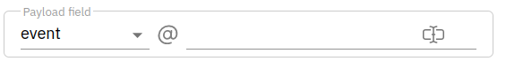

# Part 3. Data reference and resource in plugins

In the third part of the tutorial, we will learn how to use data references, how to use resources and how to connect to
external services. We will extend our plugin with the following functionality. 

The plugin needs to send the user defined data to be sent to user defined API. We will also have to extend our form with
the above data (data, and API endpoint).

## Let's get started

Often when coding a plugin, we want to use the data defined by the user. For example, the user references some data
from the internal state of the workflow that he wants to an external API. To do this he uses so-called dot notation. 
Dot notation is a way of specifying the location of the data. It looks like this. 

```
<source>@<path.to.data>
```

This is a working example:

```
event@properties.email
```

It means get the data from the event from its `properties.email`. A full description of all sources and how the data
reference works can be found [here](../../notations/dot_notation.md).

In this tutorial we are interested in how to use this entry and retrieve data, and how to put a field in the form that
will require a dot notation entry.

## Data reference

Let's start with the form. To add a new field to the form we will use the `dotPath` component and in the `form / FromGroup
/ FormFields` section we will add the following code:


```python
FormField (
   id = "data",
   name = "Data to send",
   description = "Please provide data to send",
   component = FormComponent (type = "dotPath", props = {"label": "Data to send"})
)
```

This way we get:
```python hl_lines="10-15"
form = Form(groups=[
    FormGroup(
        name="Event type plugin configuration",
        description="Define required event type",
        fields=[
            FormField(
                id="event_type", name="Event type",
                description="Event type to check",
                component=FormComponent(type="text", props={"label": "Event type"})),
            FormField(
                id="data",
                name="Data to send",
                description="Please provide data to send",
                component=FormComponent(type="dotPath", props={"label": "Data to send"})
            )
        ]
    ),
]),
```

With this, we will get a field of this type in the form.



Then we need to extend `init` in register function with a `data` field and extend an object that will store the data and
verify its correctness at the same time.

So I would add to init:

```python hl_lines="3"
init = {
  "event_type": "",
  "data": ""
}
```

and add to the `Configuration` object:


```python hl_lines="3 12-16"
class Configuration(PluginConfig):
    event_type: str
    data: str

    @validator("event_type")
    def must_not_be_empty(cls, value):
        if len(value) == 0:
            raise ValueError("Event type can not be empty.")
        return value


    @validator("data")  # (1)
    def data_must_not_be_empty(cls, value):
        if len(value) == 0:
            raise ValueError("Data can not be empty. ")
        return value
```

1. Validates the data property. It is defined as string, but it __may not be empty__ string

We have configuration data, now it's time to read data entered in the form and read data
from [dot notation](../../notations/dot_notation.md).

We do it as follows:

In the run method:

```python hl_lines="2 3"
async def run(self, payload: dict, in_edge=None):
    dot = self._get_dot_accessor(payload)  # (1)
    data_to_send = dot[self.config.data]  # (2)

    if self.event.type == self.config.event_type:
        return Result(port="MyEvent", value=data_to_send)
    else:
        return Result(port="NotMyEvent", value={})
```

1. Get the DotAccessor object that will convert the dot notation to the data. 
2. Convert anything that is defined in `config.data` to the real data from the workflow and assign it to data_to_send

## Resource

In many cases, it is necessary to link the plug-in to some resource. It can be e.g. a database, API, etc. Usually, such
resources need login credentials. We don't want to keep them in a plugin as they can be used in many plugins. For this
purpose, it is necessary to create a resource. The resource consists of credential data and sometimes a URL.

For example, let's add a functionality to our plugin that will send the data pointed by the user to the defined API (a
resource).

For this purpose, we will create a resource that will have the following data

```json
{
  "url": "api-url",
  "method": "api-method",
  "api_key": "api-key"
}
```

The resources are created in the `tracardi/service/setup/setup_resources.py` directory

We add the following code to the `get_resource_types()` function

```python
ResourceSettings(
    id="my-api-url",  # (1)
    name="Custom API URL",  # (2)
    icon="web",  # (3)
    tags=["api"],  # (4)
    config={  # (5)
        "url": "<api-url>",
        "method": "<api-method>",
        "api_key": "<api-key>"
        },
    manual="custom_api_url_resource"  # (6)
),
```

1. Resource Id. A unique string that identifies the resource.
2. Resource name
3. Resource icon.
4. The tag that describes the resource. It is used to filter the resources in the plugin form.
5. Resource configuration `*.md` file name __containing documentation__ on how to get authorization data, e.g. 
   when the resource is an external system. 
6. The documentation file is located in the __tracardi-api/docs/resources__ directory

This is the set of data the system needs to add a resource. After restarting the server, we can click on `Resources` in
the Tracardi GUI menu, then `Add new resource` and the list of resources will include `Custom API URL`. The resource we just created.
The form will also include an object:

```json
{
  "url": "<api-url>",
  "method": "<api-method>",
  "api_key": "<api-key>"
}
```

which we defined in the config property and which should be filled by the user.

### Loading resource

Once we have a resource, we can load it in our plugin. We do this in the `set_up` method. We add the following two lines
to the `set_up` method

```python
from tracardi.service.domain import resource as resource_db

resource = await resource_db.load (config.resource.id) # (1)
self.credentials = resource.credentials.get_credentials (self, output = MyResourceConfig) # (2)
```

1. Read resource id from `config.resource.id`. Note the object `config.resource` must be defined in the config 
2. Get data for authorization (credentials), which is an object defined in `ResourceSettings` in the `config` property,
   and filled in by the user when creating the resource.

The first line reads the resource id from `config.resource.id`. Note that we do not have such field in the config yet
and we need to add it (we'll do it in a moment)

The second line reads `credentials` from the resource, i.e. the object that we defined in the `config` property of
the `ResourceSettings` object above and a user filled when creating the resource.

The whole `set_up` method should look like this:

```python
from tracardi.service.domain import resource as resource_db

class MyPlugin (ActionRunner):

    config: dict
    credentials: MyResourceConfig # (1)

    
    async def set_up (self, config):
      self.config = config
      resource = await resource_db.load (config.resource.id)
      self.credentials = resource.credentials.get_credentials (self, output = MyResourceConfig)


    # (2)
```

1. We have added the credentials' property of type `MyResourceConfig`. We'll have to define it yet.
2. Rest of plugin code.

### Validating the resource 

We still have some parts missing. We need to validate the data from the resource and extend the configuration so that
the user can select the appropriate resource in the form.

To verify the data from the resource and make it readable, we need to create the `MyResourceConfig` object. I named
it in this line:

```python
 self.credentials = resource.credentials.get_credentials(self, output=MyResourceConfig) # (1)
```

1. See `output = MyResourceConfig`

In `output=MyResourceConfig`, I requested that the credentials loaded from the resource be in the form of a
`MyResourceConfig` object. I don't have it yet, so let's create it. We usually store resource objects in the
directory: `tracardi/domain/resources`

=== "tracardi/domain/resources/my_resource_config.py"
    ```python
    from pydantic import BaseModel, AnyHttpUrl
    from typing import Optional 
    
    
    class MyResourceConfig(BaseModel):
        url: AnyHttpUrl
        method: str
        api_key: Optional[str] = None
    ```

!!! Tip
     It must have the same schema as defined in config in `ResourceSettings`. Note that I defined `url` as` AnyHttpUrl` this
     means it can only accept a string that looks like a URL. On the other hand, `api_key` is of type `Optional[str]`, which
     means that such a property may not be available or be None.

We already have an object, so we have to extend the plug-in configuration with the resource. The resource will be
selected from the list of available resources, and it will be identified as the resource __name and id__.

Example

```json
{
  "id": "9bb2a926-b6ae-4cad-9b3c-9380ea7bfede",
  "name": "My API"
}
```

For this purpose, we will add a resource to the plug-in configuration, which, let me remind you, is in the `register`
function under the `init` property.

It should look like this:

```python hl_lines="8-11"
def register () -> Plugin:
    return Plugin (
        start = False,
        spec = Spec (
            module = __name__,
            className = MyPlugin.__name__,
            init = {
                "resource": {
                    "id": "",
                    "name": ""
                },
                "event_type": "",
                "data": ""
            },
            inputs = ["payload"],
            outputs = ["MyEvent", "NotMyEvent"],
            version = '0.1',
            license = "MIT",
            author = "Your Name"
        ),
        metadata = MetaData (
            name = "My first plugin",
            desc = 'Checks if the event type is equal to my-event.',
            group = ["Test plugin"]
        )
    )

```

We also need to extend the configuration validation object.

```python hl_lines="4"
from tracardi.domain.named_entity import NamedEntity

class Configuration(PluginConfig):
    resource: NamedEntity # (1)
    event_type: str
    data: str

    @validator("event_type")
    def must_not_be_empty (cls, value):
        if len (value) == 0:
            raise ValueError ("Event type can not be empty.")
        return value
        
    @validator("data") 
    def data_must_not_be_empty(cls, value):
        if len(value) == 0:
            raise ValueError("Data can not be empty. ")
        return value    

```

1. NamedEntity is an object containing __id and name__. It is already defined in Tracardi.


### Resource select field

It remains to add a field to the form that will allow user to select a resource from the list of defined
resources. Remember that there may be different types of resources created in the system, so we need to filter them so
that only those related to our plugin are on the list of resources.

This is done by pointing to the tag we defined in `ResourceSettings`. In our case it is `api` __(tags=["api"])__.

Now we have all the information. We must extend the form with the __resource select__ field that displays available
resources, so the user will be able to select one.

Please add this code to `form` in the `register` function.

```python
FormField(
    id="resource",
    name="Resource",
    description="Select your API resource.",
    component=FormComponent(type="resource", props={"label": "API Resource", "tag": "api"})  # (1)
),
```

1. Notice tag property equal to `api`

The `form` property should look like this.

```python hl_lines="6-11"
form = Form(groups=[
    FormGroup(
        name="Event type plugin configuration",
        description="Define required event type",
        fields=[
            FormField(
                id="resource",
                name="Resource",
                description="Select your API resource.",
                component=FormComponent(type="resource", props={"label": "API Resource", "tag": "api"})
            ),
            FormField(
                id="event_type",
                name="Event type",
                description="Event type to check",
                component=FormComponent(type="text", props={"label": "Event type"})  # 
            )
        ]
    )
])
```

Up till now:

* We created a resource and resource validation object
* Extended the configuration and validation of plugin initial configuration
* Extended the plugin form with the resource select field. 

The last part is connecting to the API

!!! Info
    This will be described soon

