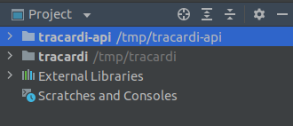

# Python development environment


## Software prerequisites

* Docker
* Python version 3.8.x
* Pip
* Python Virtual Environment
* PyCharm
* Git

Install the above software and we're ready to start.


# Launching Elasticsearch

Open a terminal and enter: 

```
docker run -p 9200:9200 -p 9300:9300 -e "discovery.type=single-node" docker.elastic.co/elasticsearch/elasticsearch:7.13.2

``` 

You have run a single instance of elasticsearch in the console. When you want to stop it, press CTRL+C 


!!! Tip

    If you want elasticsearch to run in the background, type: 
    `docker run -d -p 9200: 9200 -p 9300: 9300 -e "discovery.type = single-node" docker.elastic.co/elasticsearch/elasticsearch:7.13.2`

# Download the source code

Open a terminal and go to the directory where you want to keep the code. Enter:

```bash
git clone https://github.com/Tracardi/tracardi  #(1)
git clone https://github.com/Tracardi/tracardi-api #(2)
```

1. Clones tracardi repository. Code will be available in tracardi folder.
2.  Clones tracardi-api repository

# Create virtual environments 

We need to create 2 virtual environments. Type:

```bash
cd tracardi-api
python3.8 -m venv venv  # (1)
cd ..
cd tracardi
python3.8 -m venv venv # (2)
```

1. Installs virtual environment with python 3.8 for tracardi API
2. Installs virtual environment with python 3.8 for tracardi library

!!! Tip  

    Before creating the virtual environment make sure you have version 3.8.x installed. Type `python --version` to see the python version.

# Install dependencies


=== "Linux"

    ```bash
    # Activates virtual environment (1)
    cd tracardi-api
    source venv/bin/activate
    
    # Installs dependencies
    pip install -r app/requirements.txt
    deactivate 

    cd ..
    
    cd tracardi
    source venv/bin/activate
    
    # Installs dependencies (2)
    pip install -r tracardi/requirements.txt
    deactivate
    ```

    1. Only tracardi-api is required to run the API. Tracardi library will be installed as dependency.
    2. Installs dependencies of Tracardi API.

=== "Windows"

    ```bash
    cd tracardi-api
    venv\\Scripts\\activate
    
    // Installs dependencies
    pip install -r app\\requirements.txt
    deactivate

    cd ..

    cd tracardi
    venv\\Scripts\\activate
    
    // Installs dependencies
    pip install -r tracardi\\requirements.txt
    deactivate

    ```

=== "Mac OS"

    ```bash
    # Activates virtual environment (1)
    cd tracardi-api
    source venv/bin/activate
    
    # Installs dependencies
    pip install -r app/requirements.txt
    deactivate 

    cd ..
    
    cd tracardi
    source venv/bin/activate
    
    # Installs dependencies (2)
    pip install -r tracardi/requirements.txt
    deactivate
    ```

    1. Only tracardi-api is required to run the API. Tracardi library will be installed as dependency.
    2. Installs dependencies of Tracardi API.

!!! Tip  

    Before creating the virtual environment make sure you have version 3.8.x installed. Type `python --version` to 
    see the python version.

!!! Bug "Trouble shooting"

    If you see an error that some of the libraries can not be installed, this may mean that you do not have python 
    version 3.8.x installed in your virtual environment.


# Importing project into PyCharm 

The API and tracardi library are installed. Now it is time to open IDE and run it inside code editor.
Tracardi API depends on tracardi library we will need to reference library inside Tracardi API project.

1. Open `PyCharm`
2. Click `File/Open`
3. Find and select `tracardi-api` folder
4. Click open project in `new window`
5. In the right lower corner next to maser branch, select `<no-interpreter>`
6. Click `add interpreter` and select existing environment 

Now it is time to open `tracardi library` and reference it as dependency of `tracardi-api`

1. Open `PyCharm`
2. Click `File/Open`
3. Find and select `tracardi` folder
4. Click open project as `attach`

You should see something like this in your PyCharm editor.



# Running inside PyCharm

1. Find folder `app` in `tracardi-api`
2. Find file `main.py`
3. Right click on it and select `Run 'main.py'`

Now the Tracardi API is running. You sould see the following logs:

```text
INFO:     Started server process [59653]
INFO:uvicorn.error:Started server process [59653]
INFO:     Waiting for application startup.
INFO:uvicorn.error:Waiting for application startup.
INFO:     Application startup complete.
INFO:uvicorn.error:Application startup complete.
INFO:     Uvicorn running on http://0.0.0.0:8686 (Press CTRL+C to quit)
INFO:uvicorn.error:Uvicorn running on http://0.0.0.0:8686 (Press CTRL+C to quit)
```

!!! Bug "Trouble shooting"

    If your logs stop on `INFO:uvicorn.error:Waiting for application startup.` that means your elasticsearch 
    docker is not running. Run it and the API will resule after the database is ready.  

!!! Warning "Running inside PyCharm"

    Running API inside PyCharm has some pros and cons. Pros are that you can debug the execution of API. Cons are that 
    when you change the code you have to rerun the program. 
    If you want to auto reload the API run in terminal 
    
    ```bash
    USER_NAME=admin PASSWORD=admin uvicorn app.main:application --reload \
    --host 0.0.0.0 --port 8686  #(1)
    ```

    1. Sets default username: password as admin: admin and runs Tracardi API on port 8686.

    The above command will run serveral copies (workers) of Tracardi API.

!!! Tip

    ```
    .../elasticsearch/connection/base.py:193: ElasticsearchDeprecationWarning: Elasticsearch built-in security features 
    are not enabled. Without authentication, your cluster could be accessible to anyone. See 
    https://www.elastic.co/guide/en/elasticsearch/reference/7.13/security-minimal-setup.html to enable security.
    ```

    This warining may appear when you connect to elasticsearch without credentials set-up. This is not an issue when 
    you run development version of Tracardi. 