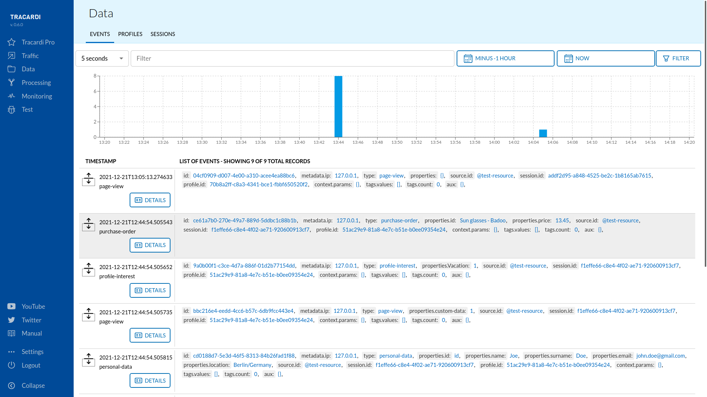
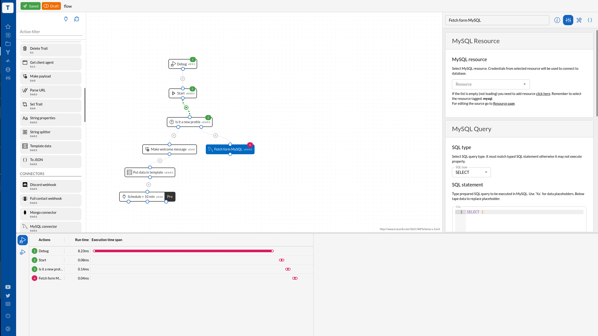

# Data flow

Przepływ danych w trakardi przechodzi przez następujące stadia:

| Stage            | Description                                                                   |
|------------------|-------------------------------------------------------------------------------|
| `Source validation`| Tracardi must have event source defined and enabled in the system.            |
| `Event collection` | Tracardi saves the event.                                                     |
| `Event routing`    | Tracardi reads a rule that defines which workflow must precess event.         |
| `Processing`       | Tracardi runs a workflow that processed event data, enhances the data,routes  |
|                  | it to external systems, etc.                                                  |
| `Profile merging`  | Tracardi checks if after processing the profile can be merged with other      |
|                  | profile that seems to be the same.                                            |
| `Profile segmentation` | Tracardi segments profile based on the rules provided by the system administator. |

# Source validation

Tracardi can collect data from many places, but all of them enter the system via two API endpoints (`/track`
and `/collect`).

However, in order to transfer data to the system, the system administrator must enable it. By creating an event source,
creates a token that, when attached to the event data, will allow it to be sent through the above-mentioned endpoints

!!! Tips

    Event sources can be found in Tracardi GUI under Traffic. We have inbound traffic that comes to Tracardi - 
    we call it `event sources`. And there is outboud traffic which are the request to external systems.

## Event collection

!!! Note "Example of an event"

    Event ia data that is described by a type, e.g. a `purchase-order` event may contain data such as __product name__,
    __quantity__ and __price__. 

All events go to a central database in elasticsearch and can be viewed via the GUI in the `Data` section.

Events can be saved in the database or only processed. For each new event without an assigned user, Tracardi will create
a new profile and assign upcoming events to it.

## Event routing

Tracardi saves the collected event and then looks for the rules that define the workflow to use to process the events. A
rule is a simple filtering process that checks that an event comes from a defined source and has a defined event type.
For example, a simple rule might require a website to be the source of an event and a page-view for the event. Then if
an event occurs meets these criteria, the rule will run the defined flow and send the event data.

The rules connect events of a given type with the indicated workflow.

!!! Warning

    Events that at the time of their registration did not have rules created, i.e. they were not connected to the process
    that processes them, are not processed. They remain in the `received state`. Tracardi does not currently offer
    reprocessing of old data. More on events can be found in [Event's core definitions](../events/index.md)

!!! Tip

    You can find more about the technical aspects of collecting events and processing them in 
    [Event tracking](../events/event_tracking.md)

## Processing

Tracardi uses workflows to process data.

Workflow is a graph of actions that will run when an event is matched with workflow. Actions may run one after another
or in parallel. Workflow is represented as a graph of nodes and connections between them. Actions are assigned to nodes
in the workflow graph. Actions may perform different tasks such as copying data from the event to profile, save profile,
query for additional data, send parts or whole data to another system or emit another event.

When the workflow ends Tracardi checks if there is a need for profile update, segmentation, and merging.

## Segmentation

Segmentation is a term that refers to aggregating prospective customers into groups or segments with common needs.
Segmentation enables companies to target different categories of consumers who perceive the full value of certain
products and services differently from one another.

Segmentation in Tracardi is based on a segment logic that is defined in the system, e.g. apply
segment `frequent-customer` to a profile that visited the page more than 10 times.

Segmentation runs after the workflow ends.

!!! Example "Common characteristics of a market segment"

    Common characteristics of a market segment include interests, lifestyle, age, gender, frequency, etc. Common examples of
    market segmentation include geographic, demographic, psychographic, and behavioral.

## Merging

Profile merging is the process of finding customer profiles that belong to one person and have been saved as separate
records for various reasons. Tracardi runs profile merging after the workflow ends.

!!! Question "How the profile can be merged?"

    In order to combine data into one record, it is necessary to indicate the field containing
    the value by which the customer data could be combined. This process will start automatically if the workflow has a merge
    profile action. 