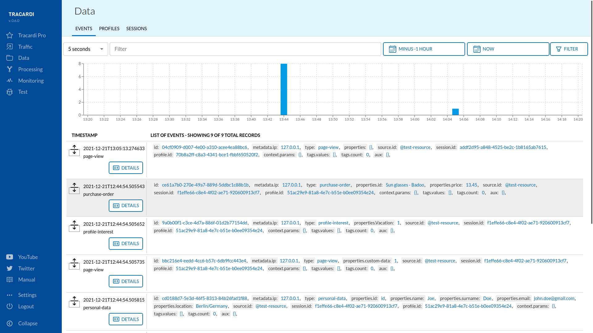
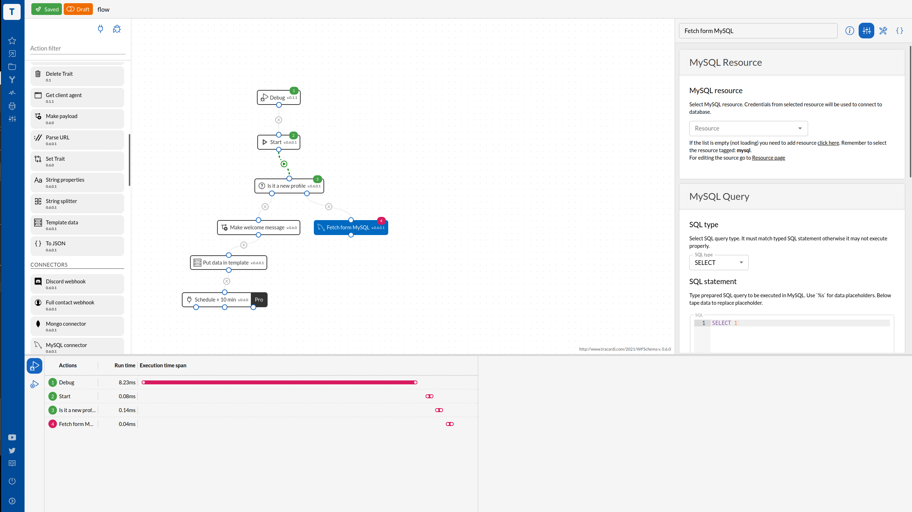
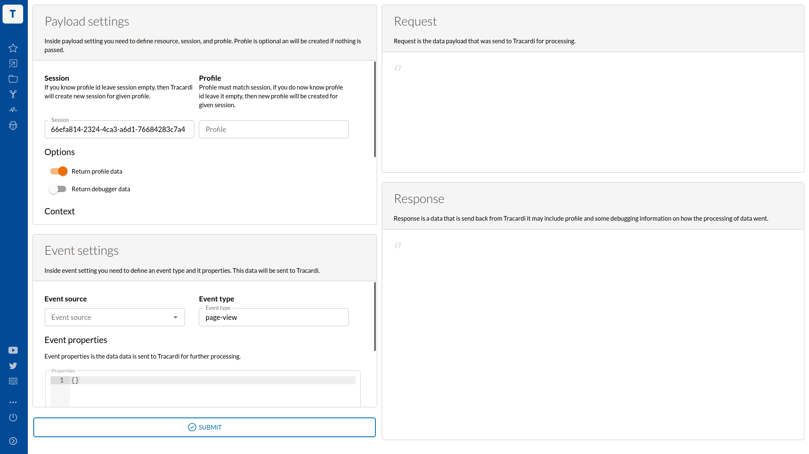

# Tracardi Customer Data Platform

[Tracardi](http://www.tracardi.com)  is an open-source Customer Data Platform.

TRACARDI is an API-first solution, low-code / no-code platform aimed at any company that 
wants to start using user data for business purposes. If you own a brand-new e-commerce platform or 
a legacy system you can integrate TRACARDI easily. Use TRACARDI for:

 * **Customer Data Integration** - You can ingest, aggregate and store customer data
   from multiple sources in real time at any scale and speed due to elastic search backend.
   
 * **Customer Data Modelling** -  You can manage data. Define rules that will model data delivered
   from your page and copy it into user profile. You can segment customers into custom segments.
   
 * **User Experience Personalization** - You can personalize user experience with
   real-time customer segmentation and targeting.
   
 * **Profile Unification** - You can merge customer data from various sources to
   single profile. Auto de-duplicate customer records. Blend customers in one account.
   
 * **Automation** - TRACARDI is a great framework for creating
   marketing automation apps. You can send your data to other systems easily

## Screenshots

### Browsing events

### Workflows

### Test console

## Video introduction

[YOUTUBE Tracardi](https://www.youtube.com/channel/UC0atjYqW43MdqNiSJBvN__Q)

