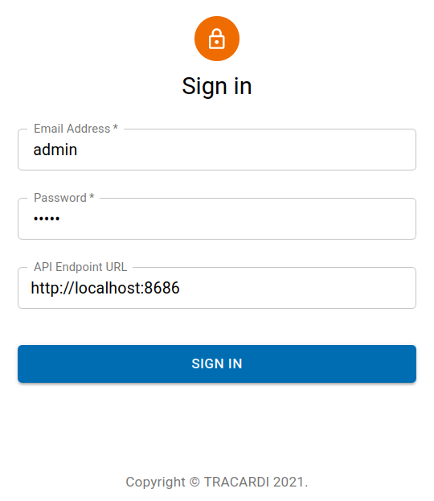

# Tracardi GUI

When everything is downloaded and installed open browser and go to http://127.0.0.1:8787 or IP where the Tracardi GUI is
installed.

## Default username and password

Tracardi default username and password is:

```
 user: admin    
 password: admin
```

This can be different if Tracardi was configured not to use default user name and password. Search for Tracardi
configuration for more details.

## Tracardi API instance



Type tracardi API instance URL. For local installation it is `http://localhost:8686`. 

!!! Tip

    You can connect your local Tracardi GUI to remote Tracardi API.


